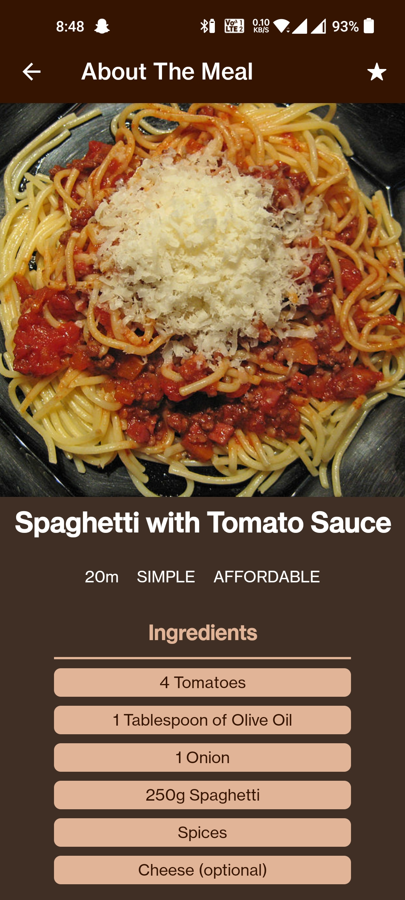

# Meals-App
This is an app made in React Native for foodies and has a categories menu from where you can select different dishes and view its cooking ingredients and steps plus add it to favourites 
## Screenshots
<table style="border: 0">
    <tr>
      <td>
                                                                                  
        
        
        
        
      </td>
    </tr>
</table>
